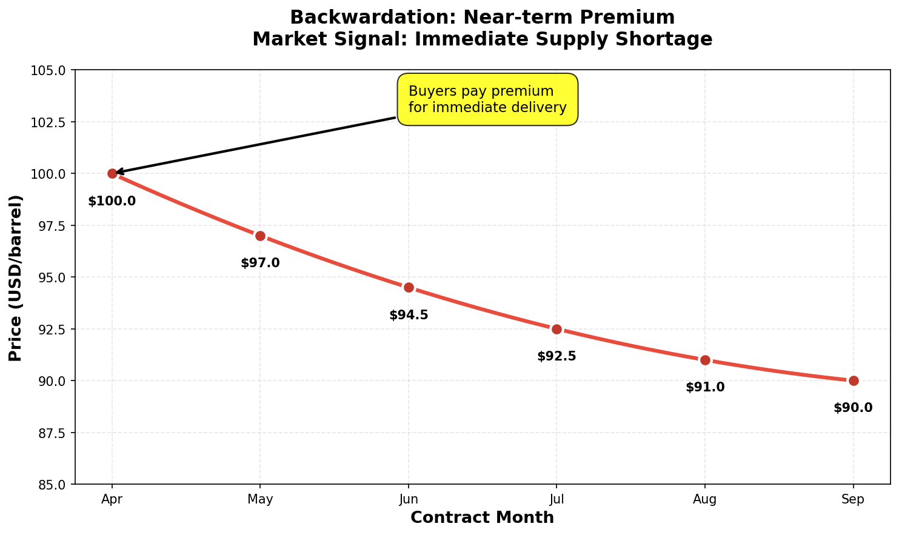
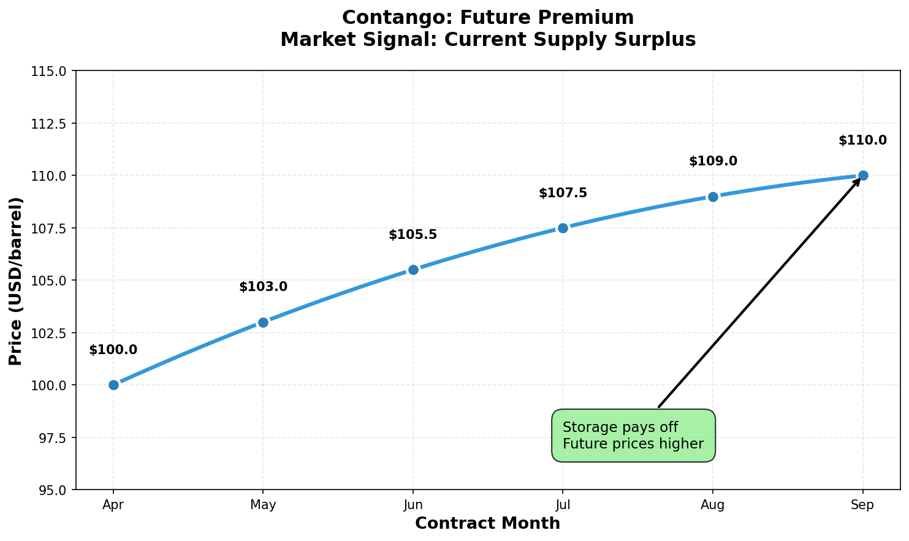

# 原始提示词

对 '输出3_润色_GPT.md' 事实核查，并提出任何遗漏视角或风险。

现在文章里有两个图，你帮着检查有没有一些地方添加图会更加直观和显得专业。比如再描述Brent-WTI spread时候，可以画一个基于真实数据的几十年这个spread历史曲线，为了区别正负，画一条spread=0的虚线分割线

对于加图，请告诉我：
1. 在原文稿每个修改的地方如何改
2. 对于每个添加的图，告诉我添加的位置，给我一个画图提示词，我在VS Code 用Claude Opus 4.5 或 Sonnet 4.5 画的英语提示词，图片上部要有标题，下部有说明（如有需要）

把这个原始提示词，以及你的输出
以 markdown 格式输出，我将拷贝进空文件 '输出4_终稿_Grok.md'

---

# 石油市场深度解析：Brent vs WTI —— 霍尔木兹危机下的多空对决

**写作时间：** 2026年3月13日

---

## 开篇

你今天加的每一升油，不只是汽油。

它里面还混着两样东西：**中东的火药味**，以及**全球供应链的紧张感**。

Brent 单日暴涨约 10%，冲上 101 美元——如果是股票，你可能会庆祝；但当这种涨幅发生在油价上，很多人第一反应不是兴奋，而是心里一沉：**通胀要来了，成本要上去了，麻烦要扩散了。**

此刻你可能在加油站排队，盯着跳动的数字发愁。但决定油价的，往往不是你家附近的加油站，而是 8000 公里外的一条海峡：**霍尔木兹**。

WTI 和 Brent，这两个缩写你在新闻里见过无数次——它们到底是什么？为什么中东一出事，美国的油和欧洲的油会一起疯涨？这篇文章用最直白的方式，把这件事讲透。

---

## 一、霍尔木兹危机：史上最大供应中断正在发生

### 一个月内的地缘震荡

**2026 年 2 月 28 日**，伊朗—以色列—美国冲突突然爆发，许多外交分析师把它称为“2026 年最大的地缘黑天鹅”。

**3 月 12 日**，事态急转直下。伊朗革命卫队（IRGC）发出极强硬的声明：**“不会让一滴油通过霍尔木兹海峡”**，甚至放话油价可能飙到 **200 美元/桶**。

这句话为什么能让市场发抖？因为霍尔木兹海峡不是普通海峡。

它最窄处只有 **34 公里**，却承载着全球约 **20%** 的石油供应。波斯湾的油要去亚洲、去欧洲，大多得从这里穿过去。

而现在——**海峡流量已降到平时的 10% 或更低。**

油轮遭袭的报道不断，航运保险费率暴涨，船东绕道、买家焦虑。很多人以为这只是“喊话”，但市场给出的反馈很直接：这不是演习，而是真正意义上的“卡脖子”。

### 数字说话：8% 供应瞬间蒸发

国际能源署（IEA）的表述极少用“史上最大”这种词，但这次它用了：**“史上最大的供应中断”。**

核心数字很刺眼：
- 全球供应减少：**800 万桶/日**（约占全球需求的 **8%**）
- 霍尔木兹海峡流量：降至正常的 **10%**
- 中东产油国被迫减产：**1000 万桶/日**

你可以把它和历史事件放在一起看：
- 1973 年石油危机：减产约 500 万桶/日
- 1979 年伊朗革命：损失约 550 万桶/日
- 2011 年利比亚内战：损失约 150 万桶/日

**今天的 800 万桶/日，超过任何一次历史记录。**

如果你觉得“8% 不算多”，换个场景：你每天用的水突然少了 8%，而且一时找不到替代水源——你会怎么做？多数人会先抢，先囤，先把风险买下来。原油市场也是同样的心理。

### 市场反应：暴涨与恐慌

价格已经把恐慌写在了脸上：
- **Brent：** 101+ 美元/桶（年初约 60 美元，涨幅约 **70%**）
- **WTI：** 96.5 美元/桶（年内低点约 55 美元，涨幅约 **75%**）
- 单日涨幅：**8–10%**，波动性创近年新高

对普通人来说，油价不是一个“金融屏幕上的数字”，而是一串会落到生活里的账单：
- 加油费上涨
- 机票更贵（燃油附加费）
- 快递外卖成本上升
- 物流成本渗透到几乎所有商品

更麻烦的是第二层效应：
> 高油价 → 通胀上升 → 美联储难降息 → 房贷车贷高企 → 资产价格承压

因此地缘战略家的那句话才会被反复引用：**“石油价格翻倍即衰退。”** 这并非危言耸听，1973、1979、2008 的历史已经多次演示。

不过在讨论“会涨到哪里”之前，我们得先把基础打牢：新闻里的“国际油价”，到底是什么？

---

## 二、科普：Brent 和 WTI 是何方神圣？

### 石油不是一种商品，是上百种商品的统称

很多人以为“石油就是石油”。其实不然。

全球有上百种原油，品质千差万别：有的轻、硫低，容易炼成汽油柴油；有的重、硫高，炼制更麻烦、成本更高。

如果每一种油都各自定价，交易会乱成一锅粥。所以市场选择几种“代表性原油”作为定价基准（Benchmark），其他原油按“基准价 ± 差价”来报价。

这就是所谓的“国际油价”。

### 全球石油基准的权力图谱

| 基准名称 | 产地 | 地位 |
|---------|------|------|
| **Brent** | 北海（英/挪） | 全球约 **2/3** 原油定价基准 |
| **WTI** | 美国（德州/俄州） | 美洲市场主导 |
| **Shanghai INE** | 中国 | 人民币定价，2018 年上市 |
| **Dubai/Oman** | 中东 | 亚洲参考 |
| **Urals** | 俄罗斯 | 俄油出口 |

**Brent 和 WTI 是绝对主角**：全球几乎所有原油交易都直接或间接参考它们。你在新闻里看到的“国际油价”，99% 就是它俩。

顺便一提：上海原油期货（INE）用人民币计价，背后有提升定价话语权、推动人民币国际化的长期目标。但在全球范围内，Brent 与 WTI 仍是最主流的定价锚。

### Brent：全球石油的“黄金标准”

**身份：** 北海多个油田的混合原油（Brent Blend），轻质低硫。

**简史：**
- 1976 年：Brent 油田投产
- 1988 年：期货在伦敦 ICE 上市
- 2000 年代：成为全球最重要石油基准
- 现在：全球约 **2/3** 原油交易参考 Brent

**为什么它能当“黄金标准”？**
1. **地理枢纽**：北海连接欧非中东，海运辐射全球
2. **品质标杆**：轻质低硫，天然适合作“通用标准”
3. **交易深度**：ICE Brent 期货流动性极强
4. **相对政治中立**：不受 OPEC 直接控制，价格更市场化

### WTI：美国的“石油名片”

**全称：** West Texas Intermediate（西德克萨斯中质油），美国内陆生产的轻质低硫原油。

**关键细节：** WTI 的交割地在俄克拉荷马州的内陆小城 **Cushing**。这个细节非常关键，因为它会直接影响价格与价差。

**简史：**
- 1983 年：NYMEX 上市，全球最早原油期货
- 2000 年代前：曾是全球最重要基准
- 2010 年代：页岩油革命 + 出口禁令，WTI 被“困”在内陆
- 2015 年：美国解除 40 年出口禁令
- 现在：WTI 重新回到全球舞台

**实力来源：**
1. **产量霸主**：美国 2026 年预计日产 **1360 万桶**
2. **期货巨擘**：WTI 期货交易量巨大
3. **品质超群**：API 约 **39.6**，硫含量约 **0.24%**，品质略优于 Brent
4. **价格风向标**：反映北美供需，也会传导到全球

**先天局限：**
- 内陆交割（不靠海）
- 管道运力可能卡脖子
- 出口依赖墨西哥湾港口

### 价差的秘密：为什么 Brent 通常更贵？

**价差公式：** Brent-WTI Spread = Brent 价格 - WTI 价格  
**正常值：** +3 ~ 6 美元/桶

很多人直觉会问：WTI 品质更好，为什么反而更便宜？答案不在“油本身”，而在**报价地点**。

- **WTI 报价**：Cushing（内陆）交割价
- **Brent 报价**：北海（海边）交割价

国际买家买 WTI 时，真正掏的钱是：
> WTI（Cushing） + 内陆运输到港口 + 海运

买 Brent 时，通常是：
> Brent（北海） + 海运

**两种油品质相近，买家比的是到岸总成本。** WTI 如果想在国际市场上卖得动，Cushing 的报价就必须**足够便宜**，去抵消那段“内陆运到港口”的额外成本——这就是 WTI 期货报价往往低于 Brent 的根本原因。

此外还有两股“溢价”：
- **全球溢价**：Brent 更像“全球价”，对地缘风险更敏感
- **亚洲偏好**：亚洲买家（含中国）更常以 Brent 作为定价锚

**价差的历史变迁：**

| 时期 | 价差 | 驱动因素 |
|-----|------|---------|
| 2011-2014 | +$10-25 | 页岩油爆发 + 出口禁令，WTI 过剩 |
| 2015-2019 | +$3-6 | 解禁出口，价差归位 |
| 2020.04 | **WTI 负价格** | 疫情 + 库存爆满，史上唯一负油价 |
| 2026.03.12 | +$4-6（收窄中） | 霍尔木兹危机，全球转购 WTI |

**2020 年 4 月** 永远值得铭记：疫情刚爆发，全球需求暴跌，但石油产量还没来得及减少。Cushing 的储油罐快满了，**没地方存油**。持有即将到期期货合约的交易员陷入绝境——如果不在到期前卖出，就要实物交割，但根本没有储罐可用。于是 WTI 期货一度跌到 **负 40 美元/桶**：卖家倒贴钱求你把油拉走。这是历史唯一一次出现负价格。

**当前特殊状况（2026.03.12）：**  
价差从传统 4-6 美元收窄到接近 **0**，部分合约甚至短暂**倒挂**。

一句话翻译：欧亚买家正在疯抢美国原油——中东油出不来，他们没有更好的选择。

### 交易策略：如何用价差赚钱（理解逻辑即可）

**1）价差交易（Spread Trading）**

同时做多一种、做空另一种，从价差变化中获利。

**当前案例：** 若你预期全球会转向 WTI，可“做空 Brent-WTI 价差”（买 WTI + 卖 Brent）。

**逻辑拆解：**
- 霍尔木兹受阻 → 中东油（Brent 体系）难以顺畅出海 → 欧亚买家急找替代
- 美国是少数能大规模增加出口的地方 → 买家把订单转向 WTI
- WTI 需求暴增 → **WTI 涨幅可能超过 Brent**
- 同时，美国出口部分替代中东 → Brent 的紧缺程度相对缓解
- 结果：价差缩小（例如 5 美元 → 2 美元，甚至倒挂）

**关键认知：** 不是“美国出口增加→大家抢买”，而是“大家抢买 WTI→美国出口被动增加”。

**2）替代交易（Substitution）**

一种原油供应紧张时，买家转向另一种。当前就是：中东断供风险上升 → 欧亚转向 WTI。

### 市场信号：极端 Backwardation 在“报警”

除了价差，还有一个关键信号：**期货曲线的形状**。

期货有不同到期月（4 月、5 月、6 月……），价格排列形成“期货曲线”，两种常见形态：

**Backwardation（现货溢价）：** 近月 > 远月  
示例：4 月 $100，5 月 $98，6 月 $96  
**含义：** 现在就缺油！买家愿出高价抢现货，不愿等；持仓者更愿意把库存卖出去（预期未来价格更低）。

**Contango（远期溢价）：** 近月 < 远月  
示例：4 月 $100，5 月 $102，6 月 $104  
**含义：** 现在不缺油；买家不急，愿等；持仓者愿意囤货等待更高的远期价格。

**当前状态（2026 年 3 月）：** 市场处于**极端 Backwardation**。近月价格远高于远月——这就是市场在用最直白的方式说：**短期供应真的紧。**

价差在收窄，曲线在倒挂；一个讲“替代”，一个讲“紧缺”。两者叠加，危机的严重性就更立体了。

---

## 三、多空对决：200 美元还是 60 美元？

同样一组数据，市场却能吵成两派。因为大家争的不是“今天涨不涨”，而是“这是不是会拖成长期”。

### 看空派：恐慌性高估，终将回落

**代表：** EIA、J.P. Morgan、IEA（长期）

**核心论断：** 即便短期被地缘冲突搅动，2026 全年仍可能供应大于需求，库存继续累积。

他们的“弹药”主要来自三点：
1. **2025 年库存暴增**：IEA 数据显示全年增加 **4.77 亿桶**（12 月单月 +3700 万桶）——市场底色偏“过剩”
2. **需求增长降速**：非 OECD 需求放缓，中国降速，印度体量仍不足以一己之力托起全球
3. **美国产量高位**：2026 年预计 **1360 万桶/日**，持续高产

**价格预判：**
- EIA：Q2 均价 91 美元，Q3 降至 80 以下，全年约 **79 美元**
- J.P. Morgan（更激进）：全年约 **60 美元**

**J.P. Morgan 的坚持值得玩味：** 即使油价飙至 100 美元，他们仍咬定 60 美元。逻辑是：当前高价更多是“恐慌溢价”，危机解决（或市场醒悟）后，价格会回到基本面附近。

**结论：** 油价严重高估，长期回落风险巨大。虽然价格处于上升通道，但买入终将像接住一把最后下落的飞刀，很容易受伤。

### 看多派：备用产能耗尽，价格可能失控

**代表：** Goldman Sachs、GlobalData、地缘战略家、伊朗官方

**核心论断：** 全球备用产能太低了，大规模供应中断一旦拖长，就不是“涨一点”的问题，而可能是“失控”。

他们的底层逻辑是：
1. **备用产能警报**：GlobalData 在 3 月 9 日就警告备用产能不足，小中断也会引发大波动——霍尔木兹危机正在验证
2. **霍尔木兹不可替代**：承载全球 20% 供应，来自海湾国家，几乎没有陆路替代方案
3. **中断规模空前**：IEA 亲口承认“史上最大”，减少 800 万桶/日

**价格预判：**
- 高盛：若霍尔木兹低流量持续 21 天，Q2 目标 **76–110 美元**（已上调）；Q4 回落至 71 美元
- 伊朗官方威胁：**200 美元/桶**
- 地缘战略家提醒：**“油价翻倍即衰退”**

**结论：** 价格上不封顶，看空派过于乐观，没有充分考虑地缘政治风险的严重性，忽视供应中断可能长期存在。

### 宏观派：油价是“通胀的毒药”

**代表：** XTB、CNBC、美联储观察者

宏观派不只盯油价，他们盯的是“油价会把什么拖下水”。

他们关心的链条很简单，也很致命：
1. **高油价 → 通胀粘性**：石油是 CPI 的重要成分
2. **通胀粘性 → 降息受阻**：油价一上去，CPI 很难下来，美联储更难放心降息
3. **高利率久拖 → 经济硬着陆**：融资更贵、消费更弱、企业更谨慎，最终衰退风险上升

历史上那句“油价翻倍即衰退”之所以被反复提起，是因为它确实经常应验：
- 1973–1974：油价翻倍 → 全球衰退
- 1979–1980：油价翻倍 → 美国深度衰退
- 2007–2008：油价 50 → 147 美元 → 金融危机（虽非唯一原因，但大幅加剧压力）

如今油价从 60 到 100，涨了约 70%。如果继续冲到 120（接近翻倍），宏观派担心历史再演一次。

更深一层风险是：霍尔木兹不只运石油，还运 LNG。若天然气也受阻，供暖、发电、工业、食品（化肥→粮价）都会被波及。

**结论：** 油价是通胀毒药，可能触发 2026 下半年经济硬着陆。

### 关键信号：价差收窄

在各种观点争论里，市场自己也在“投票”。

- 传统价差：4–6 美元
- 当前：接近 0，部分合约倒挂

**解读：** 欧亚买家用订单说话：中东不顺畅，就转向美国。美国出口激增。

问题也随之变得更尖锐：**美国能替代多少？能扛多久？**

---

## 四、WTI 能否“救场”？美国替代中东的可能与极限

如果美国原油能大规模替代中东原油，短缺就能缓一口气；如果替代有限，油价就可能在地缘风险里被反复拉扯。

### 乐观信号：美国手里确实有牌

**1）产量霸权**

2026 年预计 **1360 万桶/日**，远超沙特、俄罗斯（各约 1000 万桶/日）和伊拉克（约 450 万桶/日）。

**2）出口确实在增长**

价差收窄就是最直观的证据：欧亚买家正在把需求转向美国。

**3）品质更优**

WTI（API 约 39.6，硫约 0.24%）略优于 Brent，炼厂不太会因为“品质”拒绝它。

**4）政策加持**

特朗普政府考虑：
- **Jones Act 豁免**：Jones Act 规定美国港口间运输必须用美国船只，豁免后可用外国油轮加速国内油从产地到出口港
- **鼓励出口**：虽国内油价涨，但出口利润更高

### 现实障碍：物理极限 + 政治掣肘

**1）管道与港口瓶颈**

德州、俄州产油要经管道运到墨西哥湾港口。管道运力有限，短期需求激增时就可能“堵”。

**2）远洋运输的时间与成本**

- 波斯湾 → 中国：约 6000 公里，10–12 天
- 墨西哥湾 → 中国：约 18000 公里，25–30 天

危机中大家愿意多付钱，但时间和运费的差距不会凭空消失。

**3）炼厂调整成本**

炼厂设备往往针对特定油种优化。中国炼厂长期用中东 Oman 油，突然改用 WTI 需要调参，甚至改造，短期不可能“无痛切换”。

**4）美国国内政治压力**

美国国内汽油价格也在涨。大量出口推高国内价格，会引发政治压力。

因此你会看到一种“拉扯式政策”：一边讨论 Jones Act 豁免以鼓励出口，一边又讨论释放 SPR 以压低国内价格。

### 判断：部分替代，难填全部缺口

- **短期（数周）：** WTI 可部分替代，但管道、港口、海运的物理约束限制规模，难填满 800 万桶/日缺口
- **中期（数月）：** 若危机持续，美国会尽力增供增运，但也难独自补齐全部
- **长期（半年+）：** 若冲突拖长，全球能源格局可能被迫重排，更多国家加速转向西半球来源，减少对中东依赖

### 新增视角：战略储备的缓冲力量

值得注意的是，IEA已正式提议释放史上最大规模战略石油储备（约4亿桶），美国SPR也在讨论同步释放。这可能是短期内最强“救火”手段，能直接桥接部分800万桶/日缺口，显著限制油价失控风险。同时，高油价本身会引发“需求破坏”——航空、物流、工业消费快速萎缩，历史证明价格一旦破100美元，需求会比预期更快回落。

### 交易指南：盯紧价差

如果你只想抓一个“最直观的晴雨表”，那就是：**Brent-WTI 价差。**

- **价差持续收窄/倒挂** → 替代效应强 → 紧缺缓解一些 → 油价上行空间受限
- **价差重新扩大** → 替代能力不够 → Brent 地缘溢价回归 → 油价可能再冲

**当前：** 价差正在收窄，替代效应已在发生。能持续多久，取决于美国的物理运力与霍尔木兹危机的长度。

---

## 五、这和你有什么关系？

宏观归宏观，最后都会落在生活里。你不炒原油，也会被原油“炒到”。

### 直接冲击：钱包在缩水

**1）加油费**  
油价 60 → 100，涨约 70%。零售价虽不完全同比例（还包含税费与炼制成本），但 30–40% 的涨幅很难躲。月加油费 500 元 → 700 元，一年多花 2400 元。

**2）机票**  
航空燃油是航司大成本。油价涨，票价或燃油附加费都会更硬。

**3）快递外卖**  
物流成本上升，迟早会传导到消费者端。

**4）供暖电费（间接）**  
天然气价格常与石油联动。若 LNG 运输也受阻，供暖与发电成本会跟着抬升。

### 间接杀伤：通胀—利率的恶性循环

一句话概括：**油价涨，通胀更黏；通胀黏，降息更难；降息难，经济更硬。**

细拆就是：
1. 通胀粘性更强
2. 美联储更难降息
3. 高利率压制房地产、汽车与大宗消费
4. 企业融资更贵，投资与招聘更谨慎
5. 最终经济放缓甚至衰退

### 深层威胁：衰退风险在上升

历史上油价暴涨之后，衰退往往会在 6–12 个月后出现。今天油价从 60 到 100 已经涨了 70%，如果继续冲到 120（接近翻倍），宏观风险会更尖锐。

更别忘了：霍尔木兹还运 LNG。天然气一旦受阻，工业和民生的压力会更“立体”。

### 普通人的应对

我们无法决定国际油价，但可以决定自己怎么应对：

**1）关注油价走势**  
留意 Brent/WTI。若持续上行，非必要的长途出行可适当调整。

**2）留意通胀数据与美联储政策**  
每月 CPI 与利率决议，会影响房贷车贷成本与资产价格。

**3）投资者量力而行**  
能源板块在油价上行时往往走强，但波动也更大。非专业不建议追涨。记住：**涨得快，也跌得快。**

**4）企业评估成本传导**  
企业主与采购负责人要评估能源成本上升对业务的影响，必要时考虑调价或对冲。

**5）中国特别提示**  
中国是全球最大原油进口国，约 70% 原油来自中东，霍尔木兹风险对我们更“贴脸”。国内成品油价格有调整机制但存在滞后，可关注发改委油价调整窗口（通常每 10 个工作日）。投资者可留意 A 股“三桶油”（中石油、中石化、中海油）与上海原油期货（INE SC），但也要意识到政策调控风险：为了稳定民生，国内油价涨幅可能被阶段性压制。

---

## 结语：不确定的未来

到这里，你至少可以把“新闻里的国际油价”翻译成人话：
- **Brent** 更像全球油价的“主锚”
- **WTI** 更像美国供需的“镜子”
- 霍尔木兹危机带来史上最大供应中断
- 市场分歧巨大：60 美元 vs 200 美元，背后是“危机会不会拖长”的争论
- 美国原油能救场，但更可能是“救一部分”，加上IEA史上最大储备释放与需求破坏，油价上行空间已被明显压制
- 高油价最终会通过通胀与利率，影响每个人

接下来会怎样？没人能拍胸脯。

200 美元？60 美元？还是 80–100 美元震荡？这取决于：
- 霍尔木兹何时复航
- 冲突升级还是缓和
- 美国出口能力能挖到什么程度（以及IEA 4亿桶储备释放效果）
- 全球经济能否承受高油价冲击
- IEA 的 4 亿桶储备何时、如何释放

但有一件事可以确定：**全世界都在盯着那条海峡。**

下一次你再看到“Brent”“WTI”，你不会再把它们当作陌生的字母组合——你会知道，它们正在决定你明天的生活成本。

---

**【声明】** 本文仅为市场信息整理与教育科普，不构成任何投资建议。石油市场波动性极大，投资需谨慎。文中数据来源于 EIA、IEA、Goldman Sachs、Reuters 等公开来源，截至 2026 年 3 月 12–13 日。
