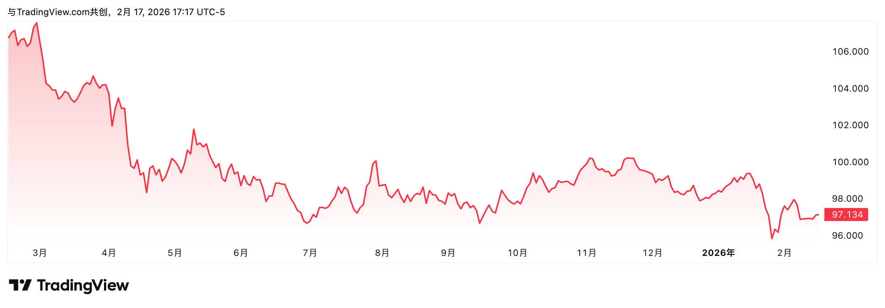

别再迷信 AI 增长了！金融时报警示：这种“老土”股票正悄悄成为全球避风港。

理查德·伯恩斯坦顾问公司（Richard Bernstein Advisors）的 CEO 兼 CIO 最近在《金融时报》发表了一篇文章，指出美联储在 2026 年可能正带着投资者踏入一片“从未见过的盲区”，并给出了他的投资建议。

在这里，我用大白话把这篇文章给你解释阐述出来，即便你是金融小白也能看懂。

# 前所未有的“反常”：美联储在火上浇油？
## 强劲的经济
在宏观经济管理的常规逻辑中，美联储的政策通常扮演着“对症下药”的角色。一般来说，只有当经济陷入衰退、失业率攀升，或者企业投资意愿极度低迷时，美联储才会选择降低利率。

因为降息了，钱放银行不划算了，人们就把钱从银行拿出来投资和消费。全社会的借贷成本（贷款利息）降低了，企业更愿意贷款扩张，从而将低迷的经济重新拉动起来。

然而，2026 年的现实情况已经完全违背了上述教科书式的准则。当前的美国经济增长极度强劲，最新公布的季度名义 GDP 增速竟然达到了惊人的 8%，这意味着市场交易异常活跃，资金流动的速度极快。

从历史横向对比来看，除了疫情封控结束后的那种报复性反弹，现在的增长速度堪称过去 20 年来最强劲的时期。

既然经济运行已经如此之快，根本不存在“救市”的必要，但美联储却依然释放了降息信号，这种刺激显然是不合时宜的。

## 美元走软，汇率走弱
按照正常的经济规律，如果一个国家的经济增长非常强劲，其货币通常会走强，因为全球投资者都想买入该国的资产。但奇怪的是，尽管美国经济数据亮眼，美元最近却表现得相当疲软。以美元指数（DXY）来衡量，美元在过去一年里已经下跌了约 10%。

美元走软本身就带有一种“通胀效应”。因为美元不值钱了，美国从国外进口原材料、零件和消费品的成本就会变高，这相当于在向美国国内“输入”通胀。在这种背景下，如果美联储继续降息，美元的吸引力降低，投资者就会抛售美元，只会让美元进一步贬值，导致进口货越来越贵，物价压力进一步堆积。

## 汇率走弱
通常情况下，美国财政部一直奉行“强势美元”的政策，以此维持美元在全球的霸权地位。然而，在美元已经处于下跌通道时，美联储如果执意降息，实际上是在向全世界释放一个信号：美国正在默认甚至转向一种“弱势美元”的政策模式。

对于投资者来说，这标志着一个巨大转折的开始。过去近二十年里，美国投资者几乎不需要担心美元持续走弱的问题，但现在这个安全垫正在消失。

当美元不再值钱，死守着美国本土的资产（如美股增长股）可能不再是最佳选择，因为你的美元资产换算成本国货币后，所带来的汇率损失会吞噬你的投资收益。

这种“强经济、弱货币、再加息”的怪异组合，正是理查德·伯恩斯坦所说的前所未有的挑战。这种“反常”的操作，美国现代史上只有 20 世纪 70 年代发生过，而那次的后果是物价飞涨，也就是我们常说的恶性通胀。