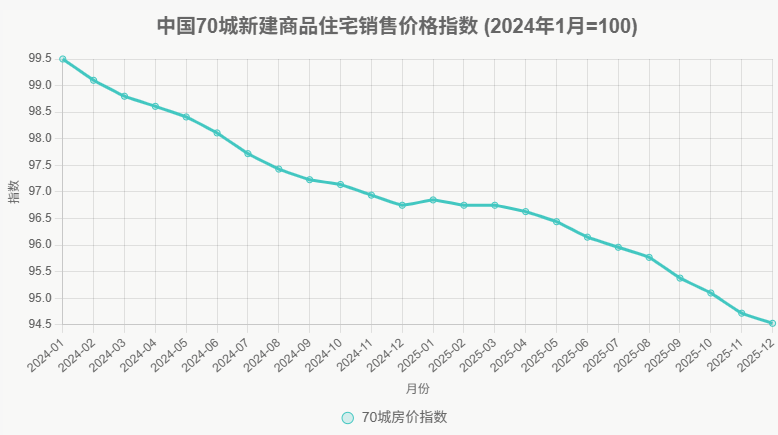

【大白话金融】读懂同比和环比，看穿财经数据里的套路

# 目录
- 前言
- 同比和环比到底是什么？
    - 同比：和去年同一时期比
    - 环比：和上一个周期比
    - 一个例子看懂两者区别
- 为什么需要这两种比法？
    - 同比消除季节性，但要小心基数陷阱
    - 环比抓拐点，但容易被季节性误导
    - 同一组数据，媒体永远选"最好看的那个比法"
- 财经新闻实战：具体案例怎么看？
    - CPI数据：通胀看同比，拐点看环比
    - GDP数据：中国看同比，美国看环比
    - 房价数据：70城房价指数的秘密
- 看懂数据背后的常见陷阱
    - 陷阱一：环比持平不等于没变化
    - 陷阱二：增速高不一定是好事
    - 陷阱三：增速放缓不等于要完蛋
    - 陷阱四："边际改善"是财经新闻的万能遮羞布
    - 陷阱五：单月数据容易失真
- 总结

# 前言

如果你经常刷财经新闻，大概率见过这样的句子：

"11月CPI同比上涨2.3%，环比下降0.1%..."

"三季度GDP同比增长4.9%，环比增长1.3%..."

看到这里，脑子是不是开始犯迷糊了？同比涨了，环比又跌了，那到底是涨了还是跌了？

很多人不是不关心经济，而是每一个字都认识，连在一起就开始懵。今天这篇文章，就干一件事：把财经新闻里最常见的"同比"和"环比"，用人话说清楚。

# 同比和环比到底是什么？

财经新闻报数据，本质就是在选一种方式跟你比。几乎所有财经数据，都不是绝对好或绝对坏，关键在于它在跟谁比。

同比和环比，就是两种最常见的比法。

## 同比：和去年同一时期比

同比，顾名思义，就是和**去年同一时期**比。今年11月的数据，和去年11月比，这就是同比。今年第三季度，和去年第三季度比，也是同比。

为什么要和去年同期比？因为很多东西有季节性。羽绒服冬天卖得好，夏天卖不动；空调夏天热销，冬天没人要；春节前消费猛增，节后骤降。如果你拿今年11月的羽绒服销量，和去年7月比，那当然涨了，但这种比较不是废话吗？

所以同比的核心作用是：**消除季节性因素，看"去年这个时候到今年这个时候，到底有没有真正增长"。**

## 环比：和上一个周期比

环比，就是和**上一个相同长度的周期**比。11月的数据和10月比，这是月度环比。第三季度和第二季度比，这是季度环比。

为什么要看环比？因为同比虽然能消除季节性，但它有个致命缺点：滞后。

假设经济从今年8月开始走弱，但同比数据要和去年8月比。如果去年8月本来就不好，那今年8月的同比数据可能还显得"不错"，根本看不出问题。

这时候环比就派上用场了。它能**快速捕捉最新的变化趋势**。环比连续上涨，说明势头正在变好；环比连续下跌，说明势头正在变差；环比持平，说明进入了平台期。

一句话总结：**同比看长期趋势，环比抓短期拐点**。

## 一个例子看懂两者区别

假设你是个卖奶茶的老板，下面是你的月销售额：

| 月份 | 2024年 | 2025年 |
|------|--------|--------|
| 1月  | 100万  | 110万  |
| 2月  | 80万   | 90万   |
| 3月  | 120万  | 130万  |
| 4月  | 150万  | 160万  |

看2025年2月的数据。同比是(90-80)/80 = +12.5%，比去年2月增长了，生意在变好。但环比是(90-110)/110 = -18.2%，比上个月1月少了，这个月掉了。

为什么会这样？因为2月有春节，很多人回家过年，店铺还关门几天，销售自然比1月少。但和去年2月（也有春节）比，还是增长的。

这就是同比和环比的区别。同比告诉你"和去年同期比，你进步了"，环比告诉你"和上个月比，你退步了"。两个都对，但看的角度不一样。

# 为什么需要这两种比法？

## 同比消除季节性，但要小心基数陷阱

同比最大的好处是消除季节性。冰淇淋不能和羽绒服比，今年夏天的销量就该和去年夏天比。

但同比有个致命问题：它非常依赖去年那个时候是不是一个"正常年份"。

如果去年发生过疫情、暴雷、封城、行业被一刀砍，那今年的同比"暴涨"，很多时候只是去年太低，今年随便一动就显得很猛。

2021年就是个经典案例。2020年疫情导致很多数据跌入谷底，2021年经济复苏，同比数据一片飘红：出口同比+30%，工业增加值同比+15%，一堆媒体欢呼"经济爆发式增长"。但实际上，只是从2020年的坑里爬出来而已。

这就是"基数效应"，也叫"低基数陷阱"。从坑里爬出来的时候，增速看起来很高，但可能还在坑里，只是比坑底高一点而已。

所以看到同比数据特别亮眼的时候，第一反应不应该是"哇，真好"，而应该是"去年是不是特别差？"

## 环比抓拐点，但容易被季节性误导

环比的好处是快。它能第一时间捕捉到趋势的变化。经济学家和交易员最爱看环比，因为它能提前告诉你拐点来了。

但环比也有坑：季节性波动。

春节前消费环比肯定涨，节后环比肯定跌，这是规律。如果你2月看到"消费环比大跌30%"就慌了，那就被误导了。

所以看环比，要么看连续几个月的趋势（连续三个月环比负增长，那确实有问题），要么看"季节性调整后的环比"。

所谓**季节性调整**，就是统计局用数学模型，把每年固定会出现的季节性波动（比如春节、国庆、圣诞）提前算好，从数据里剔除掉。调整后的数据更能反映真实的经济走势，不会被节假日干扰。我们经常看到的"季调后环比"就是这么来的。

## 同一组数据，媒体永远选"最好看的那个比法"

这是最关键的一条，也是最容易被忽略的。

同一组数据，可以有多种比法，而新闻标题永远选最符合它叙事的那一个。

举个真实例子：某月房地产数据，
- 同比-8%（还在跌）
- 环比+2%（这个月比上个月多了一点）

如果媒体想唱多，标题就是："楼市环比上涨2%，市场回暖迹象显现"。

如果媒体想唱空，标题就是："楼市同比下跌8%，寒冬仍在持续"。

两个标题都没说谎，但给人的感觉完全不同。

更隐蔽的操作是：同比不好看就写环比，环比不好看就写同比，两个都不好看就写"边际改善"和"结构优化"。

**什么是“边际改善”？** 简单说就是"虽然还在烂，但没那么烂了"。比如房地产销售去年同比-40%，这个月同比-35%，标题就写"楼市边际改善"。听起来很正面，但实际上还在跌，只是跌得慢了点。

**什么是"结构优化"？** 就是总量不行，就挑个别亮点说。比如整体消费增速放缓，但新能源汽车销量暴涨，标题就写"消费结构持续优化"。没说错，但掩盖了整体疲软的事实。

这两个词是财经新闻的万能遮羞布，看起来专业，实际上什么也没说，哈哈哈哈。

所以真正成熟的读法不是问"数据是涨是跌"，而是问"还有没有另一种比法，没被写出来"。

最简单的方法：看到新闻只写了环比，你就去查同比；只写了同比，你就去查环比。很多时候，被隐藏的那个数据，才是真相。

# 财经新闻实战：具体案例怎么看？

## CPI数据：通胀看同比，拐点看环比

CPI（居民消费价格指数）是衡量通胀的核心指标。每个月新闻都会报。

"11月CPI同比上涨2.3%，环比下降0.1%"

同比+2.3%告诉你：和去年11月比，物价涨了2.3%。这是在看通胀的绝对水平。2%左右是温和通胀，经济健康；4%以上就是通胀压力大，央行可能加息；负数就是通缩，经济可能衰退。

环比-0.1%告诉你：和10月比，物价下降了0.1%。虽然同比还在涨（2.3%），但环比已经转负，说明涨价势头在减弱，可能是拐点。

专业投资者会同时盯着两个数据：
- 环比连续上涨 + 同比加速，说明通胀失控，央行要加息，利空股市。
- 环比转负 + 同比放缓，说明通胀见顶，央行可能降息，利好股市。

## GDP数据：中国看同比，美国看环比

中国的GDP报告："三季度GDP同比增长4.9%，季调后环比增长1.3%"

中国媒体更关注同比，因为同比更稳定，不容易被短期波动误导，方便和年度目标（比如"全年增长5%左右"）对比。

美国的GDP报告："Q3 GDP季调后环比折年率增长3.2%"

美国人更关注环比折年率。什么意思？就是把这个季度的环比增速，换算成如果全年保持这个速度会是多少。美国人急性子，等不到年底看全年数据，每个季度都要算出一个"年化增速"，方便美联储及时调整政策。

**为什么中美看数据的方式不一样？**

这不是习惯问题，而是两国经济运行机制决定的。

中国有五年规划、年度目标（"今年GDP增长5%左右"），政策相对稳定，年初定的目标年底验收。所以同比最实用——它能直接告诉你"和去年比，今年完成得怎么样"。而且中国的财政政策、货币政策调整周期比较长，不需要每个季度都神经紧绷地盯着环比。

美国是市场主导经济，波动更频繁，美联储每6周开一次会，随时可能调整利率。他们等不了一年，必须每个季度就知道经济是加速还是减速，所以环比折年率最重要——它能第一时间告诉美联储"该加息还是降息"。

简单说：中国是"年度考核制"，美国是"季度快速反应制"。制度不同，看数据的方式自然不同。

## 房价数据：70城房价指数的秘密

每个月国家统计局都会发布"70个大中城市房价指数"。这里用一个真实案例，看看怎么用同比和环比读懂楼市。

2025年12月70城房价指数：94.53

这里的数据是指数，不是绝对价格。要判断楼市冷热，关键看同比和环比怎么变。

**先看环比：抓住最新趋势**

2025年12月环比 = (94.53 - 95.1) / 95.1 = -0.6%

环比负增长，说明12月比11月跌了。但单看一个月不够，我们看连续趋势：

| 月份 | 指数 | 环比 |
|------|------|------|
| 2025年7月 | 95.96 | -0.2% |
| 2025年8月 | 95.77 | -0.2% |
| 2025年9月 | 95.38 | -0.4% |
| 2025年10月 | 95.1 | -0.3% |
| 2025年11月 | 94.72 | -0.4% |
| 2025年12月 | 94.53 | -0.2% |

**环比连续6个月负增长**，这是明确的下跌趋势，不是偶然波动。

**再看同比：判断长期趋势**

2025年12月同比 = (94.53 - 96.75) / 96.75 = -2.3%

和去年同期比，跌了2.3%。同比转负，说明**市场已经进入下行周期**。

更关键的是，**同比负增长在扩大**：
- 2025年7月同比：-1.8%
- 2025年9月同比：-1.9%
- 2025年11月同比：-2.3%
- 2025年12月同比：-2.3%

跌幅越来越大，说明**不仅在跌，而且跌得越来越快**。

**看绝对值：和历史对比**

2024年1月指数是99.5，2025年12月是94.53，两年跌了5%。从2024年初开始，指数就没停过下跌，全年持续走低。

**结论：三个信号同时亮红灯**

1. **环比**：连续6个月负增长 → 短期趋势向下
2. **同比**：负增长且扩大 → 长期趋势恶化
3. **绝对值**：持续创新低 → 还在寻底

这明确无误地说明：**楼市在降温，而且趋势还在延续**。

如果这时候看到新闻说"楼市边际改善"，多半是在玩文字游戏——可能某个月环比从-0.4%收窄到-0.2%，但本质还是在跌，只是跌得慢了点而已。

# 看懂数据背后的常见陷阱

## 陷阱一：环比持平不等于没变化

新闻里常见这样的说法："11月CPI环比持平"

很多人一看：哦，没涨也没跌，物价稳定。错了。

环比持平不等于没变化，因为还要看同比。

**情况一：环比持平，同比上涨。**
假设10月CPI是102，11月CPI还是102（环比持平），但去年11月CPI是100，同比增速就是2%。那么这里意思就是，虽然这个月没涨，但和去年比，还是涨了2%，物价还在高位运行。

**情况二：环比持平，同比下跌。**
假设11月CPI是102（环比持平），去年11月CPI是105，同比就是-2.9%。那么意思是，虽然这个月没跌，但和去年比，已经跌了，通缩压力显现。

环比看的是"这个月的变化"，同比看的是"累积的水平"。两个要结合着看。

## 陷阱二：增速高不一定是好事

前面说过，增速高可能只是因为去年太差。

假设你开了个餐馆：2023年月营收100万，2024年疫情月营收60万（暴跌40%），2025年恢复月营收90万。

2025年的同比增速是(90-60)/60 = 50%，看起来暴涨。但实际上，90万还不到疫情前的100万，两年平均下来其实是负增长。

这就是基数效应的迷惑性。从坑里爬出来的时候，增速看起来很高，但可能还在坑里，只是比坑底高一点而已。

## 陷阱三：增速放缓不等于要完蛋

新闻里经常看到："GDP增速放缓至5%，经济承压"

很多人一看到"放缓"就慌了，觉得要出大事。但增速放缓不等于变差。

增速放缓的意思是：还在涨，只是没以前涨得那么快。

假设：去年GDP增长8%，从100万亿涨到108万亿。今年GDP增长5%，从108万亿涨到113.4万亿。增速确实从8%放缓到5%，但今年的增量是5.4万亿，依然是一个巨大的数字。

更重要的是，高速增长不可能永远持续。经济体量小的时候，增速容易高（穷国从1万亿涨到2万亿，增速100%）。经济体量大了，增速自然下降（富国从100万亿涨到105万亿，增速5%）。

所以"增速放缓"很多时候是经济成熟的标志，不是衰退的信号。但市场情绪往往是"涨得慢等于快要不行了"，这就是为什么数据还不算差，市场却提前悲观。

## 陷阱四："边际改善"是财经新闻的万能遮羞布

如果你经常看财经评论，一定见过这个词：边际改善。

这个词特别神奇，因为它永远是正面的，但又什么也没说。边际改善翻译成人话就是："虽然整体还是不好，但比最差的时候稍微好了一点点。"

假设：去年11月房地产销售同比-40%，今年10月同比-35%，今年11月同比-32%。

新闻标题就会写："楼市边际改善，拐点初现"。

但实际情况是：还在跌，只是跌得慢了一点，离正增长还远着呢。

边际改善的套路就是：上一个周期特别惨，这一个周期稍微不那么惨，标题直接写"边际改善"。

所以下次看到"边际改善"，脑子里自动补一句："是因为之前太烂了吗？"

## 陷阱五：单月数据容易失真

经济数据有噪音，单月数据可能失真。春节因素会影响1-2月数据，2月只有28天但3月有31天，暴雨台风会影响生产。

专业做法是至少看连续三个月的数据，或者看多个指标交叉验证。一个月的数据可能是偶然，连续三个月的趋势才靠谱。

# 总结

财经新闻的作用，不是单纯告诉你真相，而是**用数据塑造情绪**。

这不是阴谋论，这是行业规律。看涨的分析师会强调利好数据，看跌的分析师会强调利空数据，同一组数据能讲出两个完全相反的故事。

你不需要把每个数字都研究透，只要养成三个习惯就够了。

1. 它在跟谁比？同比还是环比？基期正不正常？

2. 这个对比对象合理吗？是不是低基数？是不是选择性展示？

3. 有没有另一种"没写出来的比法"？主动去查被隐藏的数据。

做到这三点，你就已经比大多数人冷静得多了。数据不会说谎，但会误导。要成为数据的主人，而不是数据的奴隶。

慢慢地，你就能透过数字看到背后的真相，而不是被标题牵着鼻子走。

---

**摘要：** 